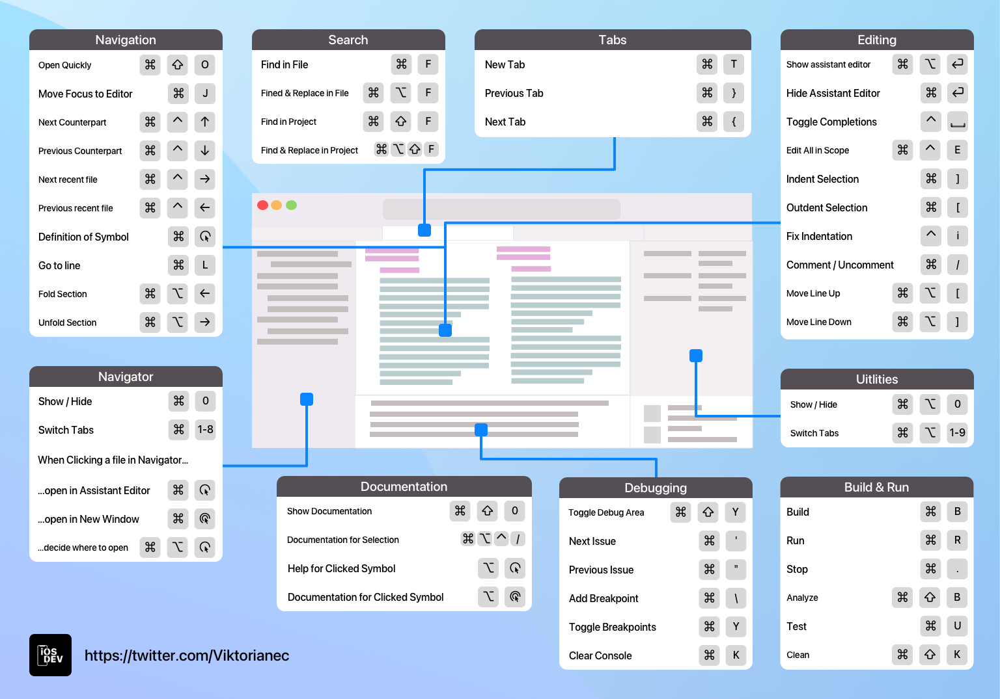

# Cheat sheet for Xcode
Shortcuts tutorial in Xcode

You can use this resource however you like and in any way you like.
Shortcuts contain blocks for the following sections:
- Navigation.
- Search.
- Tabs.
- Editing.
- Navigator.
- Documentation.
- Debugging.
- Launch.

The file is also available in .pdf

The project was created in **Sketch** using **SF** symbols from **Apple**.
For any questions you can contact me at [Telegram](https://t.me/viktorianec) and [Twitter](https://twitter.com/Viktorianec)
I also write about development here: [Telegram Channel](https://t.me/iOS_Career).
